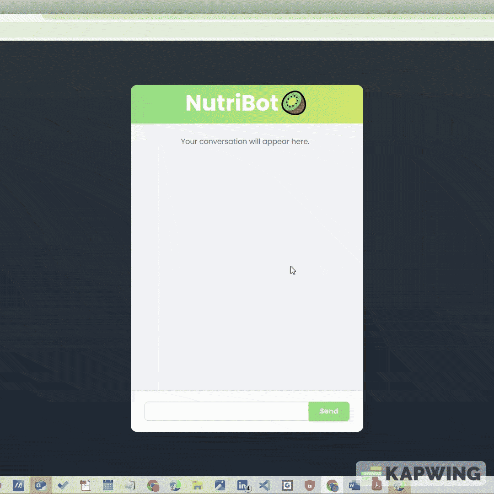

## Directory Structure

├── backend/
│   ├── app/           # FastAPI application
│   ├── requirements.txt
│   ├── Dockerfile
├── frontend/
│   ├── pages/         # Next.js pages & API routes
│   ├── components/
│   ├── package.json
├── docs/
│   ├── README.md
│   └── rew.txt        # dev notes
├── .gitignore
└── README.md

## 🌐 Live Demo

Check out the live version of NutriBot here:  
[🔗 Your Live Chatbot Site](https://ai-chatbot-1-psi.vercel.app/)

C:\Users\Omkar\3D Objects\post_oev\ai-chatbot


<p align="center">
  
</p>

<p align="center">
  
  
  
</p>

---


# 🌟 NutriBot - AI Powered Nutrition Chatbot
Welcome to **NutriBot**, your go‐to assistant **trained on the nutritional properties of fruits and vegetables**. NutriBot excels at answering detailed questions such as _“How are the metabolic fates of copper and iron related?”_ by grounding every response in the source PDF data along with page numbre from that pdf.

Welcome to **NutriBot** — a vision toward building powerful, ethical AI systems that will empower humanity by democratizing knowledge. This project is a humble step toward a future where **AI and AGI** are allies of positive change.

NutriBot is currently designed to answer nutrition-related questions based on a **single PDF** document, but it is **future-proofed** to handle **multiple documents** seamlessly.

Locally, it leverages a FastAPI backend with the Groq LLM API and LangChain/Chroma for semantic search over embedded PDF documents, and a Next.js (React) frontend for a responsive, animation-rich chat interface. In production, it can scale to ingest **any number** of PDF files, providing on-demand nutritional guidance via vector search.

> ✨ “AI will reshape the world. Let's ensure it's a world where knowledge is free, well-being is prioritized, and every individual is empowered.”

---
 # Key Features  
 - **AI-Powered Chat:** Conversational interface using Groq LLM API integrated via FastAPI  
 - **Document Embedding & Search:** Uses open-source HuggingFace embeddings and Chroma vector store to index and retrieve PDF content  
 - **Dynamic Loading Animation:** Nutrition-themed Lottie animations during inference for engaging feedback  
 - **Responsive UI:** Built with Next.js and Tailwind CSS, fully mobile-responsive and accessible  
 - **Markdown & Links:** Bot replies support full Markdown including clickable links via `react-markdown` and `remark-gfm`  

 # Tech Stack  
 - **Backend:** Python • FastAPI • Uvicorn • Groq • LangChain • ChromaDB • PyMuPDF  
 - **Frontend:** Next.js v15 • React • Tailwind CSS • Framer Motion • Lottie-React  
 - **DevOps:** Docker • GitHub • Vercel • Google Cloud Run 

---

## 🛠️ Project Structure

- **Frontend**: [Next.js](https://nextjs.org/) deployed on [Vercel](https://vercel.com/)  
- **Backend**: [FastAPI](https://fastapi.tiangolo.com/) containerized on [GCP Cloud Run](https://cloud.google.com/run) using [Docker](https://www.docker.com/)  
- **Vector Database**: FAISS/Chroma for document retrieval  
- **LLM API**: GROQ’s LLaMA 3 model  

---


# Getting Started (Local)  
## Prerequisites  
 - Python 3.10+  
 - Node.js ≥ 18 (via NVM or direct install)  
 - pnpm or npm  
 - Docker (for containerized setup)  
# 🚀 How to Deploy Locally

### 1. Clone the Repo
```bash
git clone https://github.com/Omkar-Gavali/ai-chatbot.git
cd ai-chatbot
```

### 2. Backend Setup
```bash
cd backend
python -m venv venv
source venv/bin/activate   # or venv\Scripts\activate on Windows
pip install -r requirements.txt

# Create a .env in backend/:
GROQ_API_KEY=your_groq_api_key_here
```

### 3. Run Backend

Place your PDF files in `backend/data/` and run: 
```bash
uvicorn app.main:app --host 0.0.0.0 --port 8000 --reload
```
Backend: `http://localhost:8000`

### 4. Frontend Setup
```bash
cd frontend
npm install

# Create .env.local in frontend/:
NEXT_PUBLIC_API_URL=http://localhost:8000
NEXT_PUBLIC_CHAT_ENDPOINT=${NEXT_PUBLIC_API_URL}/chat
```

### 5. Run Frontend
```bash
npm run dev
```
Frontend: `http://localhost:3000`

---

## 🐳 Docker & GCP Cloud Run

### 1. Build Backend Image
```bash
cd backend
docker build -t nutribot-backend .
```

### 2. Test Locally
```bash
docker run -p 8000:8000 nutribot-backend
```

### 3. Push to GCR
```bash
gcloud auth configure-docker
docker tag nutribot-backend gcr.io/your-gcp-project-id/nutribot-backend
docker push gcr.io/your-gcp-project-id/nutribot-backend
```

### 4. Deploy to Cloud Run
```bash
gcloud run deploy nutribot-backend \
  --image gcr.io/your-gcp-project-id/nutribot-backend \
  --platform managed \
  --region europe-west3 \
  --allow-unauthenticated \
  --port 8000
```

---

## 💡 Features

- Embed & query PDF documents.  
- Contextual retrieval with vector DB.  
- GROQ LLaMA-based Q&A.  
- Responsive chat UI.  
- Scalable to **n** number of PDFs.  
- Secure, CORS-enabled API.

---

## 🌍 Vision & Impact

NutriBot is part of a movement:

- **Democratizing Knowledge**: Free nutritional insights.  
- **Responsible AI**: Context-aware, ethical responses.  
- **Scalable Architecture**: Ready for tomorrow’s multi-document world.  
- **Positive AGI Future**: AI as a collaborator, not a replacement.

> “We must not only imagine a better future with AI. We must build it — with responsibility, passion, and relentless optimism.”

---

## 📈 Future Scope

- 📚 **Multi-PDF Support**: Unlimited document ingestion.  
- 🔐 **Authentication**: User-specific personalization.  
- 🤖 **LLM Choice**: Swap models (LLaMA, GPT, Claude).  
- 🔍 **Advanced Retrieval**: Hybrid semantic + keyword search.  
- 🌐 **Localization**: Multi-language Q&A.  
- ⚙️ **Offline LLMs**: On-premise models for privacy.  
- 📊 **Knowledge Graphs**: Enhanced reasoning pipelines.

---

## ⚙️ Configuration Files

- **`requirements.txt`**: Python deps for backend.  
- **`Dockerfile`**: Container spec.  
- **`.env.example`**: Template env vars.

---

## 💖 Made with ❤️ for the Future

If you find this project inspiring, please ⭐ Star on GitHub and share with the world!

---

## 📜 License

MIT License © 2025


 # AI & AGI Vision  
 As AI/AGI progresses from pattern recognition to **real-world experience learning**, systems will autonomously generate data and refine themselves in situ. I foresee NutriBot evolving into a network of domain-specific advisors—nutrition, skincare, mental health—contributing to a future where AI augments human well-being at scale, democratizing access to expert guidance.  

 # Future Scope  
 - **Multi-Document Indexing:** Seamlessly ingest **n** PDFs via folder watch or S3 integration.  
 - **Plugin Ecosystem:** Connect to live APIs (recipe databases, health trackers) for real-time personalization.  
 - **Mobile App:** React Native or Next.js Mobile for on-the-go AI Wellness Coaching.  
 - **AI Safety & Ethics:** Integrate fairness and consent frameworks, inspired by Bostrom’s alignment pathways.  

 # Contributing  
 We welcome your ideas, whether it’s adding new PDF loaders, improving UI/UX, or experimenting with embedding models. Please **fork**, **commit**, and **open a pull request**—your contributions drive NutriBot toward a healthier, AI-empowered world!  

 # Credits  
 Built with 💚 by [Omkar] — shaping AI for good, one delicious smoothie at a time!  
